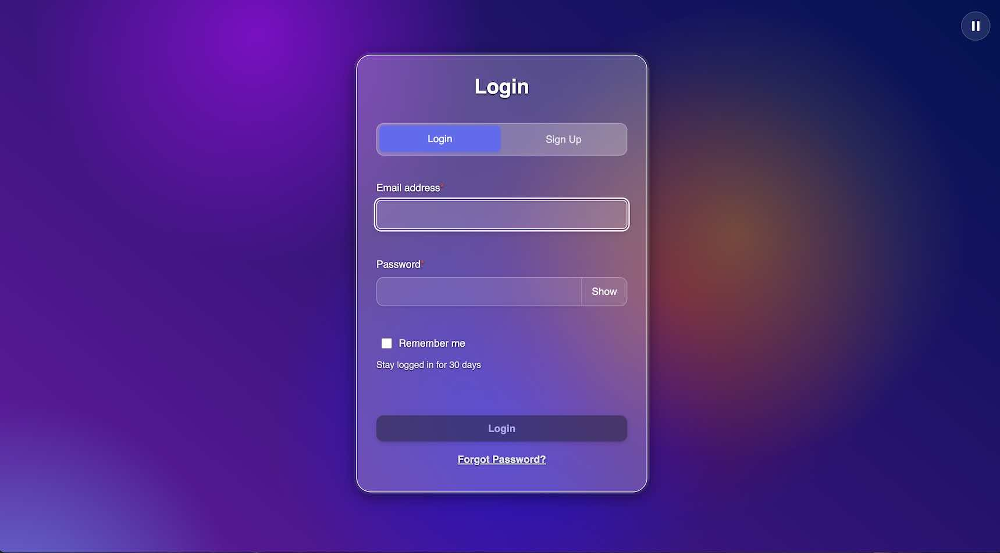
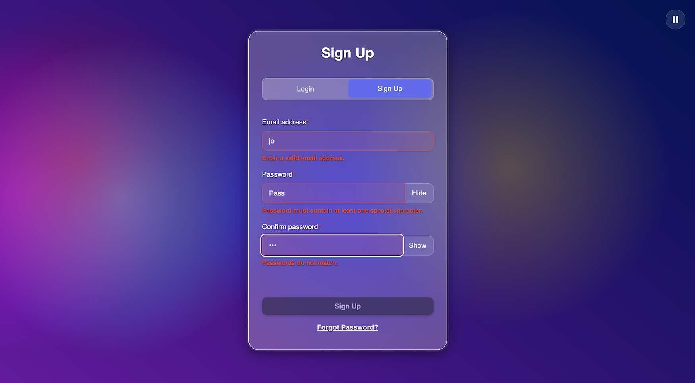
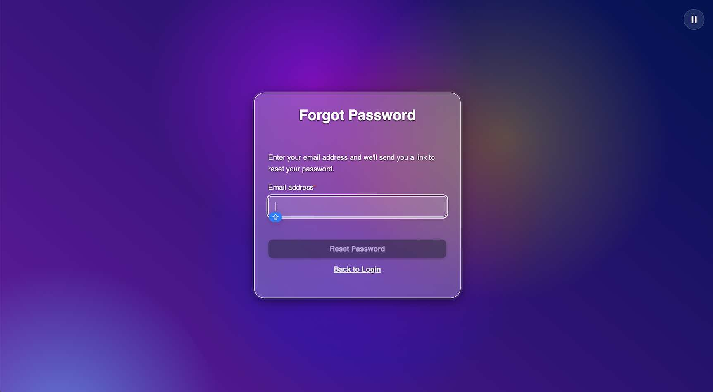

# Login Form Application6666

A modern, accessible React login form application with comprehensive form validation, authentication flows, and beautiful UI components. Built with TypeScript, React 19, and Vite.

<p align="center">
    
    
        
</p>


## Features

- **Modern React 19** with TypeScript
- **Accessible Design** - WCAG AAA compliant with semantic HTML, pausable animation and ARIA attributes
- **Form Validation** - Real-time validation with debounced input handling
- **Authentication Flows** - Login, signup, and password reset functionality
- **Remember Me** - Secure token-based session management
- **Responsive Design** - Mobile-first approach with modern CSS
- **Comprehensive Testing** - Full test coverage with Vitest and React Testing Library
- **Beautiful UI** - Animated blob background with toggle controls, animated buttons, form transitions and mirco interactions
- **Mock API** - Simulated backend

## Getting Started

### Prerequisites

- Node.js 18+ 
- npm or yarn

### Installation

1. Clone the repository:
```bash
git clone <repository-url>
cd login-form
```

2. Install dependencies:
```bash
npm install
```

3. Start the development server:
```bash
npm run dev
```

The application will be available at `http://localhost:5173` (or the next available port).

### Available Scripts

- `npm run dev` - Start development server
- `npm run build` - Build for production
- `npm run preview` - Preview production build
- `npm run test` - Run tests in watch mode
- `npm run test:run` - Run tests once
- `npm run test:ui` - Run tests with UI
- `npm run lint` - Run ESLint

## Manually using the Application

The application includes a mock authentication system for testing purposes. Use these credentials to test different scenarios:

### Login Testing

#### ✅ Successful Login
- **Email**: `user@example.com`
- **Password**: `Password123!`
- **Expected**: You'll be redirected to the dashboard after a brief loading period

#### ❌ Failed Login
- **Any other email/password combination**
- **Expected**: "Invalid email or password" error message

### Sign Up Testing

#### ✅ Successful Registration
- **Email**: `newuser@example.com`
- **Password**: `Password123!`
- **Expected**: Account created successfully, redirected to dashboard

#### ❌ Email Already Taken
- **Email**: `taken@example.com`
- **Any password**
- **Expected**: "Email already in use" error message

#### ❌ Server Error
- **Any other email** (except the success cases above)
- **Any password**
- **Expected**: "Server error" message

### Password Reset Testing

#### ✅ Successful Reset Request
- **Email**: Any valid email format (except test cases below)
- **Expected**: "Password reset email sent! Redirecting to login..." message

#### ❌ Email Not Found
- **Email**: `invalid@example.com`
- **Expected**: "Email not found" error message

#### ❌ Server Error
- **Email**: `error@example.com`
- **Expected**: "Server error" message

### Remember Me Feature

- **Check the "Remember me" checkbox** when logging in successfully
- **Close and reopen the browser** - you should be automatically logged in
- **Uncheck "Remember me"** - you'll need to log in again after closing the browser

### Form Validation

The forms include real-time validation:

- **Email**: Must be a valid email format
- **Password**: Must be at least 8 characters with uppercase, lowercase, number, and special character
- **Confirm Password**: Must match the password field
- **Required Fields**: All fields are required and show validation errors

### Testing Tips

1. **Try invalid credentials first** to see error handling
2. **Use the exact credentials** listed above for success scenarios
3. **Test form validation** by entering invalid data
4. **Check accessibility** by navigating with keyboard only
5. **Test responsive design** by resizing the browser window
6. **Try the animation toggle** in the top-right corner

### Expected Behavior

- **Loading states**: Buttons show loading text during API calls
- **Error messages**: Clear, accessible error messages appear
- **Success feedback**: Success messages and automatic redirects
- **Form persistence**: Form data is preserved during validation errors
- **Accessibility**: Full keyboard navigation and screen reader support

## Testing

The project includes comprehensive tests for all components and functionality:

### Test Structure
- Each component has its own test file (`ComponentName.test.tsx`)
- Tests use React Testing Library for semantic queries
- Mock implementations for all external dependencies
- Accessibility testing included

### Running Tests
```bash
# Run tests in watch mode
npm run test

# Run tests once
npm run test:run

# Run tests with UI
npm run test:ui
```

### Test Coverage
- Component rendering and behavior
- Form validation and submission
- Error handling and user feedback
- Accessibility features
- Mock API interactions

## Accessibility Features

The application is built with accessibility as a priority:

- **Semantic HTML** - Proper use of form, button, and navigation elements
- **ARIA Attributes** - Roles, labels, and live regions where needed
- **Keyboard Navigation** - Full keyboard support for all interactions
- **Screen Reader Support** - Proper labeling and announcements
- **Color Contrast** - WCAG AAA compliant color ratios
- **Focus Management** - Clear focus indicators and logical tab order
- **Pausable animations** - Pause the background blobs

## Styling

The project uses Sass with BEM methodology:

- **Global Styles**: `src/styles/main.scss`
- **Component Styles**: Each component has its own `.scss` file
- **Variables**: `src/styles/base/_variables.scss`
- **Reset**: `src/styles/base/_reset.scss`
- **Typography**: `src/styles/base/_typography.scss`

## Browser Support

- Chrome 90+
- Firefox 88+
- Safari 14+
- Edge 90+

## Let’s Work Together  

If you're looking for a frontend developer who can turn complex data into intuitive, high-performance, and accessible UIs — let’s chat:  
📩 **jocollierengineering@gmail.com**

## License

This project is licensed under the MIT License. 